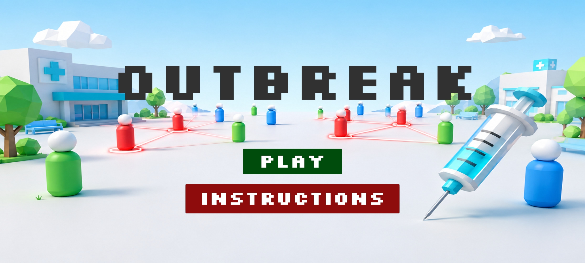
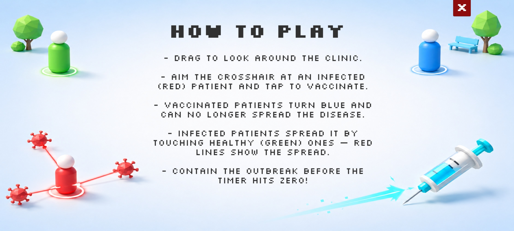
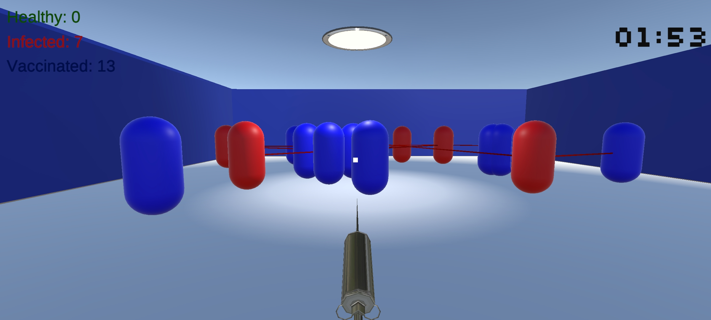

# Outbreak — Disease Spread & Vaccination Simulation

A first-person simulation: vaccinate patients and contain a spreading outbreak before time runs out. Built in Unity 6 (6000.4.5f1).

## GCGO
**Health & Wellbeing.** Mission: My mission is to improve health awareness and outcomes in underserved communities by using technology to make complex public-health concepts accessible, engaging, and actionable.

The sim makes an abstract health idea — how disease spreads and how vaccination stops it — visible and interactive.

## Problem Context
People rarely *see* how fast infection moves through a population or how vaccination breaks the chain. That gap fuels slow response and vaccine hesitancy. By letting users contain a live outbreak, the sim builds first-hand understanding of transmission and immunity — using tech as a health-education tool.

## Simulation Overview
You're a health worker at a clinic triage station. Patients wander the floor; one starts infected and spreads it by contact (shown by red lines). You aim and vaccinate patients to make them immune. Clear all infections before the timer ends.

- **Target users:** students and the public, as a health-awareness aid.

**Key interactions.**
- **Look:** drag (mouse or touch) to look around the clinic.
- **Vaccinate:** aim the centre crosshair at a patient and tap/click to fire a vaccinator beam.
- **Observe:** watch infection spread along red transmission lines and use the live counters to track
  the state of the outbreak.

## How to Play
 
- Drag to look around the triage area.
- The crosshair turns **green** when it is aimed at an infected (red) patient.
- Tap / click to vaccinate the patient under the crosshair — they turn **blue** and become immune.
- Infected (**red**) patients spread the disease to healthy (**green**) ones on contact; red lines
  show each transmission.
- **Win:** eliminate all active infections (no red patients left) before the timer hits 0:00.
- **Lose:** the timer reaches 0:00 while patients are still infected.
Colour key: **green = healthy, red = infected, blue = vaccinated/immune.**

## Unity Mechanics
- **UI** — live Healthy/Infected/Vaccinated counters, mm:ss timer, crosshair, win/lose panels, main menu.
- **Scripting** — `Person`, `GameManager`, `Vaccinator`, `CameraLook`, `MainMenuController`.
- **Collision** — trigger colliders spread infection on contact (immune patients are skipped).
- **Raycasting** — a ray from the screen centre vaccinates the patient you aim at.
- **Line Renderer (×2)** — red transmission lines between patients, and the syringe's vaccinator beam.

## New Input System
Used exclusively (no legacy input). An Input Actions asset (`GameControls`) with **Look**, **Press**, and **Point** actions bound to the generic `<Pointer>` device, so mouse (WebGL) and touch (Android) work with the same code.

## Additional Features
1. **Audio** — vaccinate and infection sounds.
2. **Particles** — a puff when a patient is vaccinated.
3. **Scene fade** — the Play button fades to black before loading.

## Build Information
- **WebGL:** [https://play.unity.com/api/v1/games/game/da7f94f9-902e-48b4-9c46-8ebf8193c27f/build/latest/frame]
- **Android APK:** [​​https://drive.google.com/file/d/1Q3HkxKbNKeiAYkz-MeOg6NodDWsCFgj6/view?usp=drive_link]

### How to run
 
**Play in browser (WebGL):** open the WebGL link above — no install needed.
 
**Install on Android (APK):** download the APK from the link, allow "install from unknown sources"
if prompted, then open it. The game is landscape-oriented; aim and tap to vaccinate.
 
**Open in Unity:** clone the repository, open the project in **Unity 6000.4.5f1**, open the
`MainMenu` scene, and press Play. (Both scenes must be in Build Settings: MainMenu = 0, Gameplay = 1.)

## Mobile Screenshots

## Known Limitation
Patients use trigger colliders, so they pass through each other. A physics-blocking version caused sticking/jitter, so the simpler trigger approach was chosen for reliability — a deliberate tradeoff. With more time: NavMesh crowd avoidance and difficulty scaling.

## Credits
Syringe model, sounds, from Unity Asset Store.
font (Silkscreen) from google fonts.
Menu images: generated by ChatGPT. 
Built with Unity 6.
Author: Fawziyyah Oke
